# Cumplimiento de los objetivos de ciberseguridad — logSguarDian

**Alcance:** objetivo general y objetivos específicos (OE1, OE2, OE3) del protocolo de ciberseguridad
(Sebastián Huertas), más las métricas de aceptación que el protocolo asocia a ellos.
**Fecha:** 2026-09-19. **Modelos vigentes:** `rf_v11` / `if_v10` (`training/models/parity_report.json`).

## Resumen

| Objetivo | Estado | Nota clave |
|---|---|---|
| Objetivo general | **Cumplido, con una salvedad** | Librería publicada en npm (`logsguardian@0.1.0`); la salvedad es la latencia (ver OE3.2) |
| OE1 — cuatro vectores, OWASP/MITRE | **Cumplido** en la implementación | La tabla OWASP/MITRE no existía en el repo; se propone abajo y debe validarse |
| OE2 — dataset ≥ 100,000 muestras | **Cumplido** en tamaño (~383,000) | Balance resuelto por ponderación, no por conteos iguales; ver salvedades |
| OE3.1 — F1 ≥ 0.80 en ≥ 3/4 categorías | **Cumplido** (4/4) | Cifras oficiales de test son de `rf_v3`; `rf_v11` tiene val pero no su lectura de test |
| OE3.2 — Δp95 de latencia | **No cumplido (margen pequeño)** | Decisión A, 2026-09-19: se evalúa en forma absoluta, 7–9 ms vs 5 ms |

---

## Objetivo general

> Diseñar e implementar una librería npm que integre un pipeline de ingeniería de características y un
> modelo híbrido de ML capaz de detectar y clasificar amenazas conocidas y anomalías estadísticas […] en
> tiempo de ejecución […] sin comprometer el rendimiento del servidor anfitrión.

| Componente del objetivo | Dónde se cumple |
|---|---|
| Librería npm | `packages/core`, publicada como `logsguardian@0.1.0` (CI de publicación en `.github/workflows/ci.yml`) |
| Pipeline de ingeniería de características | `packages/extractor` — 75 features, implementación única en TypeScript (`docs/feature-spec.md`) |
| Modelo híbrido | RF (supervisado, autoridad de bloqueo) + IF (no supervisado, solo registro/alerta) en ONNX; política en `docs/decision-policy.md` |
| Amenazas conocidas y anomalías | RF clasifica 4 clases + benigno; IF marca anomalías (`pass_anomaly`) |
| Tiempo de ejecución sin bloquear el Event Loop | Inferencia en `worker_threads` (RF dedicado + pool de IF), `docs/architecture.md` |
| Sin comprometer el rendimiento | Parcial: ver OE3.2 |

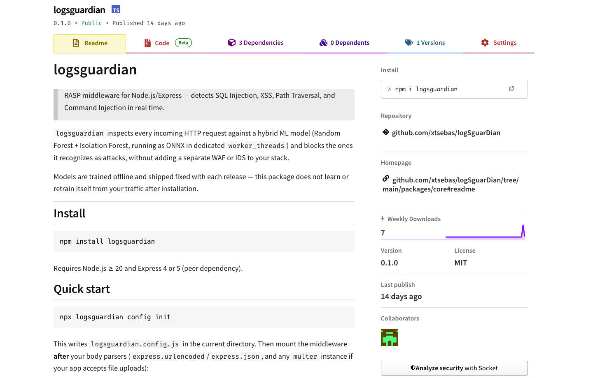
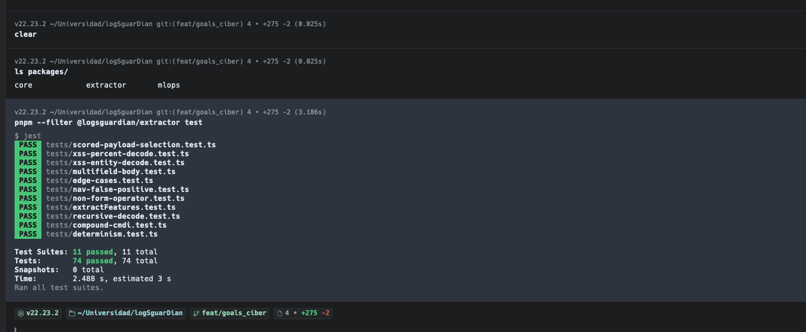

---

## OE1 — Evaluar los cuatro vectores de ataque

**Exige:** evaluar SQLi, XSS, Path Traversal/LFI y Command Injection según OWASP Top 10 2021 (A03:2021)
y MITRE ATT&CK, para fijar las categorías del dataset (OE2) y los criterios de evaluación (OE3).

**Dónde se cumple:** las cuatro categorías son la columna vertebral del proyecto:

- `training/label_map.yaml` — taxonomía canónica de cinco clases (`sqli`, `xss`, `path_traversal`, `cmdi`,
  `benign`) y mapeo de cada dataset a ellas. Para CAPEC se usan las columnas 66 (SQLi), 126 (Path
  Traversal), 88 y 248 (OS Command Injection) y 242 (Code Injection, asignada a `xss`).
- `docs/feature-spec.md` — los grupos de features 4–7 están definidos por categoría de ataque
  (SQLi, XSS, Path Traversal, Command Injection), con la categoría que discrimina cada feature.
- `docs/dataset-audit.md` — cada fuente auditada indica qué categorías cubre.
- Los criterios de OE3 (F1 por clase) se calculan sobre exactamente estas cuatro categorías.

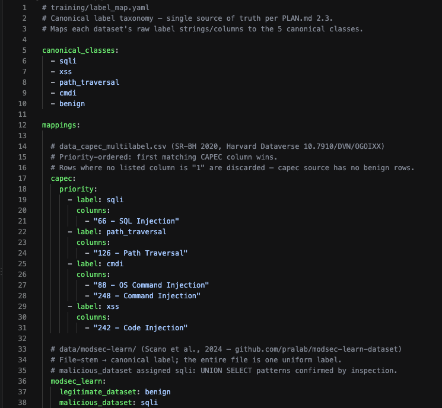
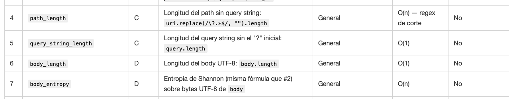
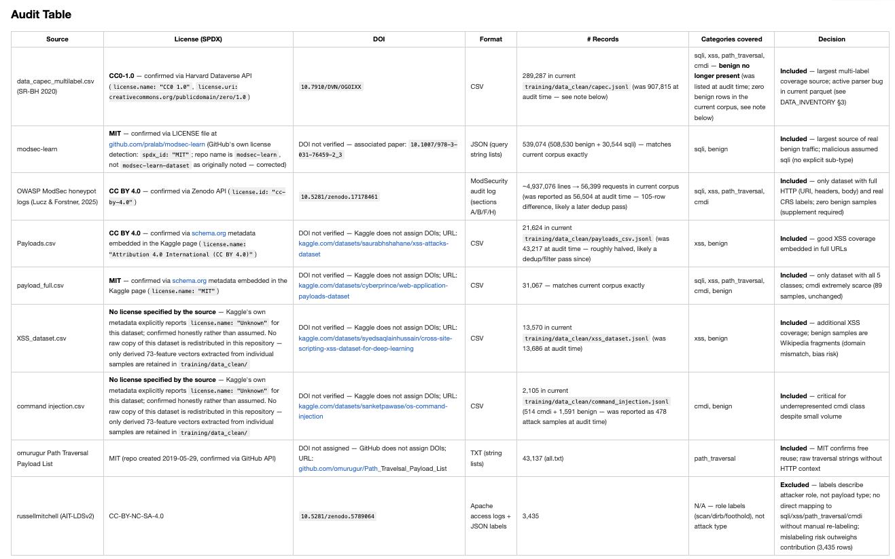

### Tabla OWASP / MITRE (propuesta, por validar)

El repo no tenía ninguna referencia a OWASP Top 10 ni a MITRE ATT&CK (`grep` en `docs/` sin resultados).
Esta tabla se arma con conocimiento general, **no con una fuente verificada en el repo**: hay que
contrastarla con las páginas oficiales antes de incluirla en el informe.

| Vector | OWASP Top 10 2021 | CWE | CAPEC | MITRE ATT&CK (aprox.) |
|---|---|---|---|---|
| SQL Injection | A03:2021 Injection | CWE-89 | 66 | T1190 Exploit Public-Facing Application |
| XSS | A03:2021 Injection | CWE-79 | 63 (ver nota) | Cobertura parcial: ataque al cliente; T1190 solo cubre el lado servidor |
| Path Traversal / LFI | **A01:2021 Broken Access Control** (ver nota) | CWE-22 | 126 | T1190 |
| Command Injection | A03:2021 Injection | CWE-78 | 88 | T1190 → T1059 Command and Scripting Interpreter |

**Notas a resolver antes de defender:**

1. El protocolo dice que los cuatro vectores se justifican por **A03:2021**. Según mi lectura de la
   taxonomía 2021, CWE-22 (Path Traversal) se clasifica en **A01:2021 (Broken Access Control)**, no en
   A03. Si es así, la frase del OE1 es inexacta para ese vector y conviene ajustarla o justificarla.
2. `label_map.yaml` asigna CAPEC-242 (Code Injection) a `xss`. Es una decisión de mapeo del dataset, no
   una equivalencia conceptual; debe declararse como tal en el informe.
3. ATT&CK no modela bien los ataques del lado cliente; decir "cobertura parcial" para XSS es más
   defendible que forzar una técnica.

---

## OE2 — Dataset de al menos 100,000 muestras etiquetadas

**Exige:** un entorno controlado y reproducible que genere un dataset estructurado de ≥ 100,000 muestras
HTTP etiquetadas, balanceando tráfico legítimo y ataques, con scripts de generación y metodología de
etiquetado documentados.

### OE2.1 — Tamaño (≥ 100,000): cumplido

Cifras medidas (salida del notebook `training/notebooks/03_random_forest.ipynb`, modelo `rf_v11`):

| Partición | Filas |
|---|---|
| Train | 268,064 |
| Val | 57,443 |
| Test | ≈ 57,000 (partición 70/15/15; el conteo exacto de esta generación no está registrado en un doc) |
| **Total** | **≈ 383,000** |

Conteo por clase en train: sqli 159,138 · benign 69,379 · xss 20,928 · path_traversal 11,787 · cmdi 6,832.

Antes de deduplicar y filtrar, las fuentes crudas suman más de 930,000 filas (`docs/dataset-audit.md`).
La estimación de 585,000–645,000 de `training/ML_READINESS.md` es de antes de corregir los parsers y
**ya no es la cifra vigente**; las cifras de la tabla superior sustituyen a esa estimación.

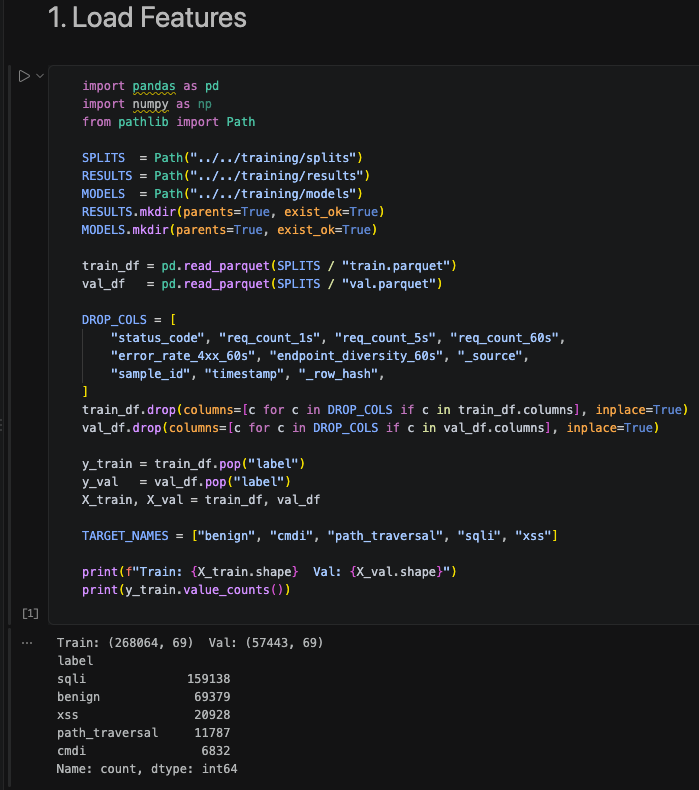

### OE2.2 — Balance entre tráfico legítimo y ataques: cumplido por mitigación, no por conteos iguales

El corpus **no está balanceado** (sqli es ~59 % de train y cmdi ~2.5 %). El desbalance se trata con
`class_weight='balanced_subsample'` en el RF y con la estrategia de muestreo de
`training/SAMPLING_STRATEGY.md` (`PLAN.md` 2.5 admite ponderación, SMOTE o submuestreo). Se probó SMOTE
para cmdi y se descartó con evidencia; lo que sí funcionó fue añadir datos reales diversos
(`docs/limitations.md` §1 y §1.1). Falta confirmar cuál parte del muestreo de `SAMPLING_STRATEGY.md`
(submuestreo de benign/sqli) se aplicó en el pipeline vigente, porque el documento describe el plan y no
el resultado final.

> **Distribución cruda antes de muestrear** (974,718 filas, 7 fuentes):
>
> | Clase | Cantidad cruda | % del total |
> |---|---|---|
> | benign | 563,689 | 57.8% |
> | sqli | 295,770 | 30.3% |
> | path_traversal | 69,176 | 7.1% |
> | xss | 37,113 | 3.8% |
> | cmdi | 8,970 | 0.9% |
>
> **Por qué SMOTE en cmdi:** tras el split, cmdi queda con ~6,279 muestras de entrenamiento — una
> proporción benign:cmdi de ~63:1, por encima del umbral 10:1 donde `class_weight='balanced'` por sí
> solo deja de ser suficiente (He & Garcia, 2009). Se aplicó SMOTE (Chawla et al., 2002,
> `k_neighbors=5`) apuntando a 25,000 muestras de cmdi (6,279 reales + ~18,721 sintéticas).
>
> **Resultado observado (sweep 2026-06-14):** SMOTE mejoró el F1 de cmdi solo +0.015 en profundidad 15
> (0.593 → 0.608) y no mejoró nada en profundidad 20 (0.772 → 0.763). La ganancia fue marginal — la
> frontera de decisión de cmdi necesita profundidad ≥ 25 sin importar la cantidad de muestras, porque
> el problema es de **separabilidad** en el espacio de features (cmdi se solapa con path traversal y
> con uso benigno de comandos de shell), no de cantidad de datos. Documentado como limitación en la
> tesis (Sección 8.3): SMOTE interpola en el espacio de 66 dimensiones, no en texto crudo, y puede
> generar combinaciones de features que no corresponden a ningún payload real.
>
> Esto es lo que en `docs/limitations.md` §1.1 se resuelve después: no con más muestras sintéticas,
> sino con datos reales diversos (SecLists + PayloadsAllTheThings), que sí rompieron el techo de cmdi.

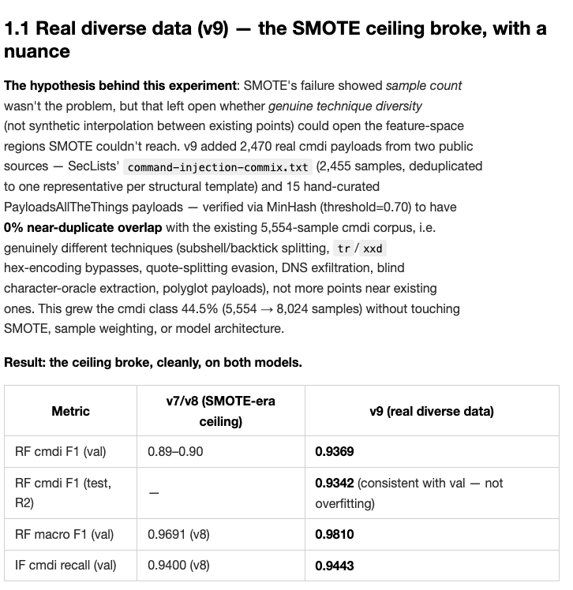

### OE2.3 — Scripts de generación y metodología de etiquetado: cumplido

- Parsers por fuente: `training/parsers/*.py` (9 parsers + `validate_canonical.py`).
- Etiquetado: `training/label_map.yaml`; esquema canónico en `training/CANONICAL_REQUEST_NOTES.md`.
- Deduplicación: `training/DEDUP_METHODOLOGY.md`. Partición estratificada por clase y fuente:
  `training/split.py`.
- Reproducibilidad y anti-fuga: `training/splits/test.lock.sha256` se versiona **antes** de cada
  reentrenamiento (`git log` muestra un commit `lock:` por generación, el último `8cbe6c9` para v11).

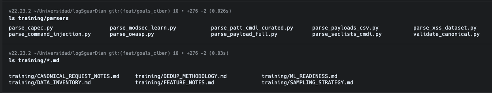
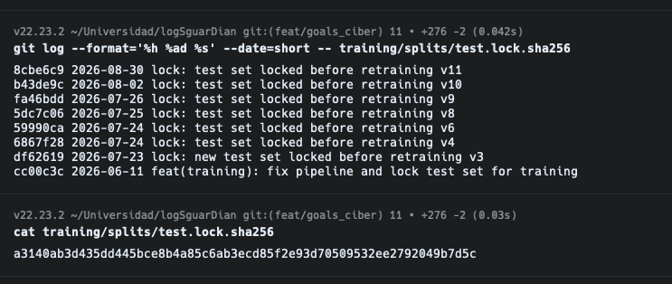

### Salvedades de OE2

1. **"Entorno … que genere un dataset".** El dataset se construye a partir de fuentes públicas
   (CAPEC/SR-BH, ModSec-Learn, OWASP honeypot, payload_full, etc.) más conjuntos sintéticos pequeños
   (`training/data_clean/`). El entorno Docker de prueba (`logSguarDian-vulnerable-project`) se usa para
   **evaluar**, no para generar el corpus de entrenamiento. Si el tribunal lee el OE2 literalmente, este
   es el punto más débil; conviene redactarlo en el informe como "dataset construido con fuentes
   públicas y validado en un entorno controlado".
2. **Un solo número canónico.** `docs/architecture.md` §2 todavía cita "1,155,302 filas / 72 features"
   de un pipeline anterior (marcado como no verificado en `docs/STATUS.md`). Hay que reemplazarlo por
   la cifra de la tabla de OE2.1.
3. **Re-bloqueo del test set.** `test.lock.sha256` se regeneró para v6, v8, v9, v10 y v11. La disciplina
   de "leer el test una vez" se aplica por generación de modelo; debe declararse así en la sección de
   amenazas a la validez.

---

## OE3 — Efectividad de la detección

### OE3.1 — Precisión, recall y F1 por categoría (criterio: F1 ≥ 0.80 en ≥ 3 de 4): cumplido

**Cifras oficiales (test set bloqueado, lectura única, `rf_v3`; `docs/decision-policy.md` §2.1, n = 59,947):**

| Clase | Precisión | Recall | F1 |
|---|---|---|---|
| cmdi | 0.8749 | 0.9170 | 0.8954 |
| path_traversal | 0.9694 | 0.9648 | 0.9671 |
| sqli | 0.9953 | 0.9956 | 0.9955 |
| xss | 0.9911 | 0.9778 | 0.9844 |
| **Macro F1 (incluye benign)** | | | **0.9682** |

**4/4 categorías ≥ 0.80**, por encima del mínimo de 3/4.

**Modelo vigente (`rf_v11`), conjunto de validación (n = 57,443):** macro F1 0.9831; cmdi 0.95,
path_traversal 0.99, sqli 1.00, xss 0.99; 4/4 ≥ 0.80. IF (`if_v10`): recall 0.9157, FP 0.0596 en val.

**Brecha a cerrar:** las cifras oficiales de test corresponden a `rf_v3`, no al modelo publicado. `rf_v11`
solo tiene métricas de validación; falta su lectura única de test para que el modelo evaluado y el
publicado coincidan. Además `training/models/class_metrics.json` sigue en `rf_v3`, por lo que
`logsguardian attacks inspect` muestra métricas de `rf_v3`.

**"Bajo condiciones de tráfico simulado":**

- Suite E2E (`e2e/detection.test.ts`, `pnpm run test:e2e`): 100 payloads por clase enviados por HTTP real
  contra Express con el middleware y los ONNX reales (`docs/results.md` §F5.7).
- Corpus SecLists de 590 payloads contra la app vulnerable (Ronda 4, `docs/vulnerable-app-evaluation/`):

| Categoría | Solo logsguardian | Solo WAF (CRS PL1) | Capas (WAF + logsguardian) |
|---|---|---|---|
| sqli | 98.7 % | 85.7 % | 100.0 % |
| xss | 97.3 % | 97.3 % | 100.0 % |
| path_traversal | 98.5 % | 87.0 % | 98.5 % |
| cmdi | 100.0 % | 100.0 % | 100.0 % |
| **Total** | **98.8 %** (583/590) | 93.2 % | 99.5 % |

De los 40 ataques que el WAF dejó pasar, logsguardian detuvo 37 de forma independiente.

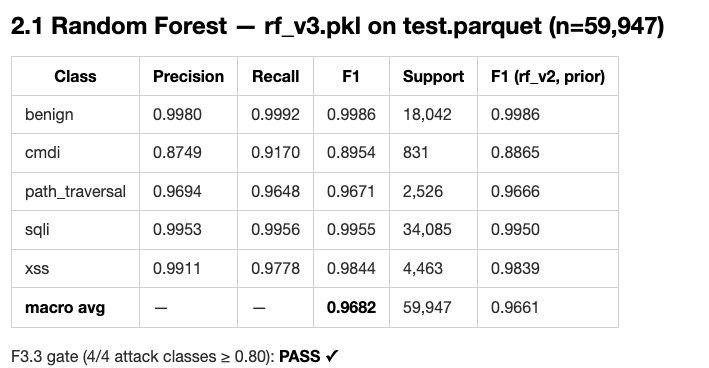
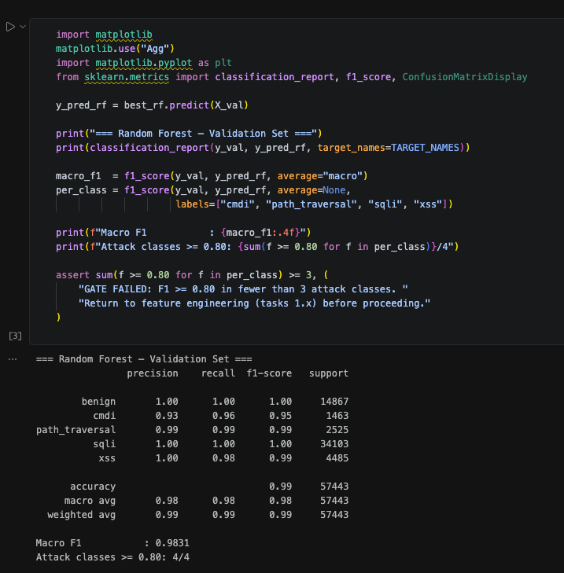
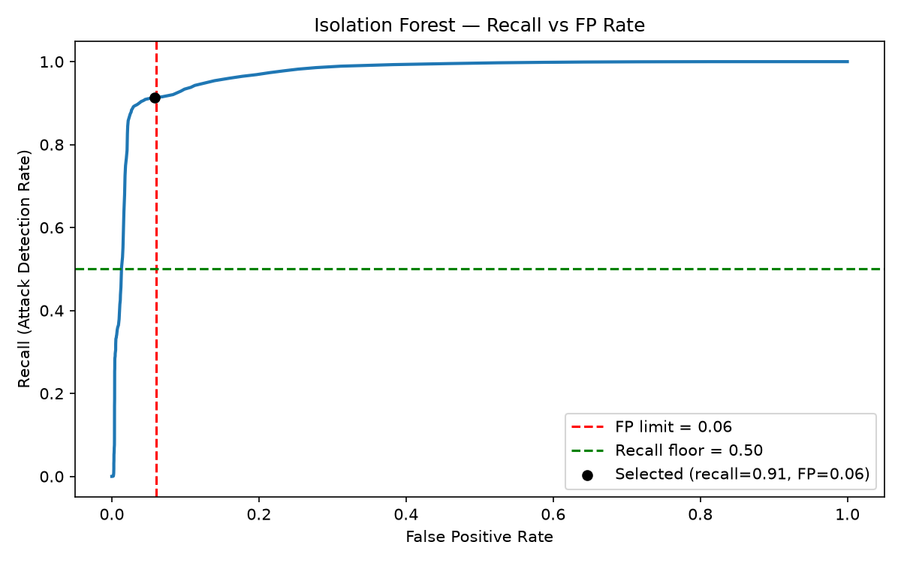
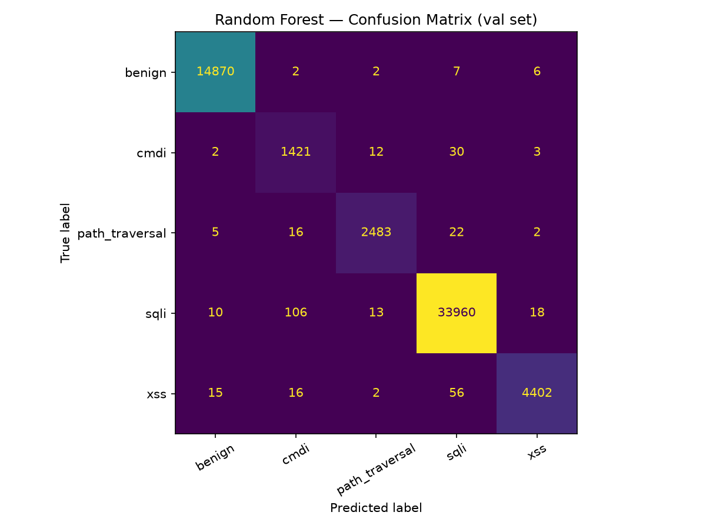
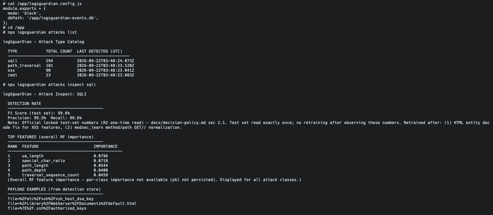
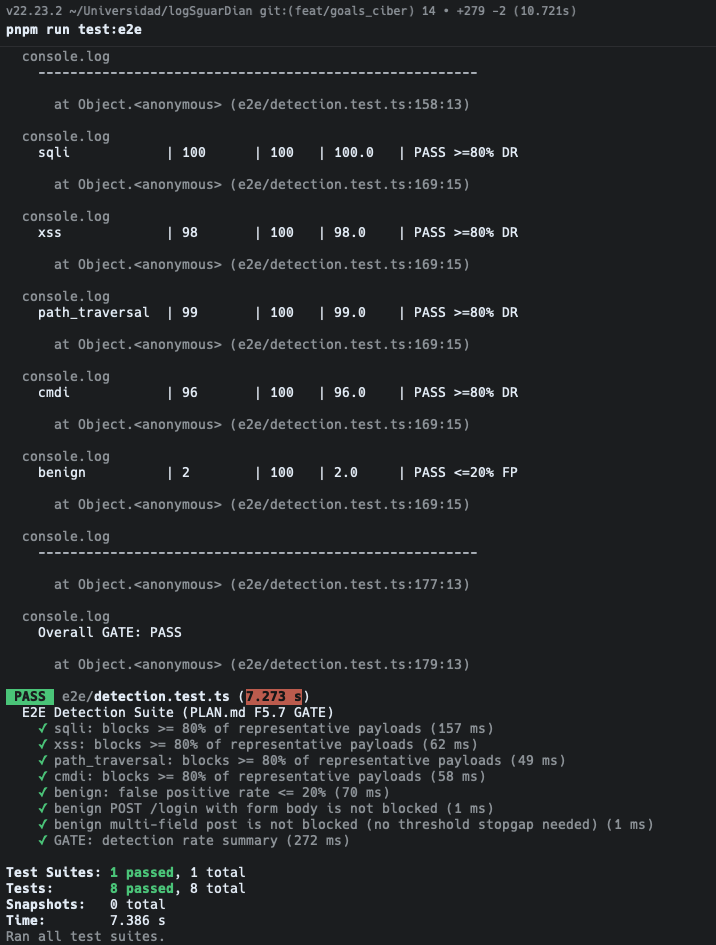
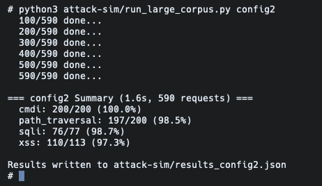
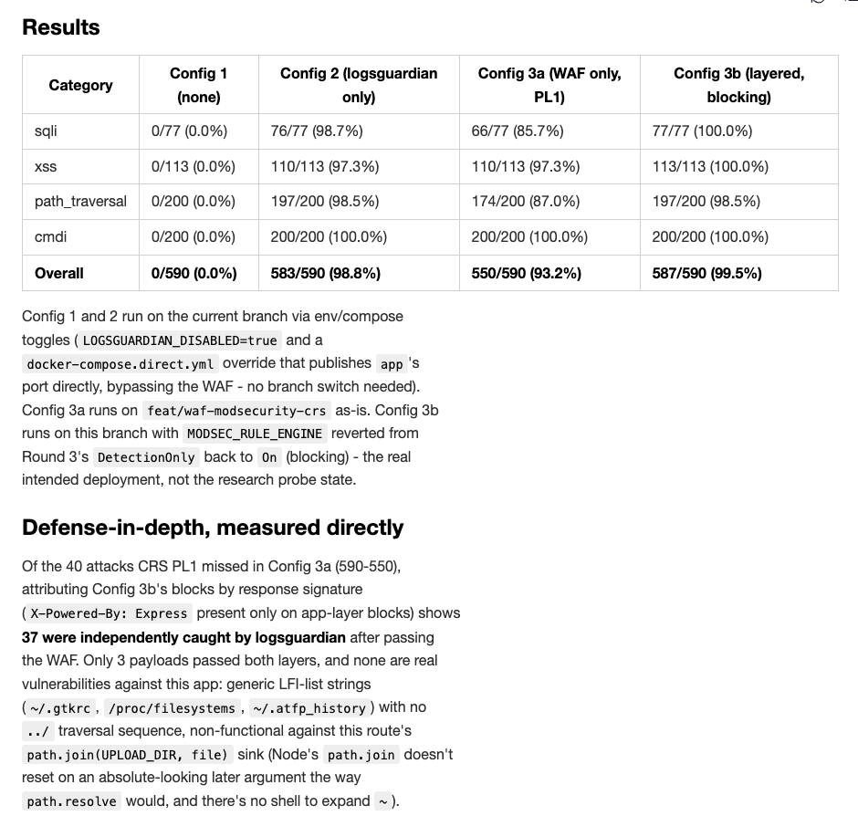

### OE3.2 — Latencia Δp95 (métrica de aceptación asociada): no cumplido, con margen pequeño

El criterio no está en el texto del OE3 anterior, sino en las métricas de aceptación del protocolo:
Δp95 ≤ 5 % (carga normal) y ≤ 10 % (carga de ataque); `PLAN.md` F6.2 lo enuncia además en forma absoluta
(Δp95 ≤ 5 ms por solicitud).

**Decisión (2026-09-19, opción A):** el criterio se evalúa en su **forma absoluta** (Δp95 ≤ 5 ms). Motivo:
la forma relativa diverge cuando el baseline tiende a cero (`Δ% = ε / p95_base × 100`), y la app de
referencia tiene un baseline de ~4–5 ms; la demostración está en `docs/results.md` §F6.5.

| Entorno | p95 sin middleware | p95 con middleware | Δp95 absoluto | Veredicto (≤ 5 ms) |
|---|---|---|---|---|
| Docker + Postgres, app de referencia (arquitectura publicada) | ~5 ms | ~12–14 ms | **~7–9 ms** | **No cumple** (excede 2–4 ms) |
| Express en Node puro, sin Docker (`docs/results.md` §A24) | 0.119 ms | 0.300 ms | ~0.18 ms | Cumple |

**Veredicto oficial: NO CUMPLIDO en el entorno de referencia, por un margen absoluto pequeño.** La forma
relativa del protocolo (≤ 5 % / ≤ 10 %) tampoco se cumple (+142 % a +178 % en la variante publicada) y
se reporta como no cumplida por la razón matemática ya documentada; no se oculta.

**Cómo leer el resultado sin exagerarlo:**

- El sobrecosto medido es de 7–9 ms de p95 sobre una app cuyo baseline es de ~5 ms; frente a la latencia
  típica de una API con base de datos y red (decenas a cientos de ms) es pequeño. Esto es un argumento,
  no una medición de impacto en throughput o CPU: no se midió.
- El entorno Docker Desktop sobre macOS añade virtualización que no existe en un servidor Linux
  (`docs/vulnerable-app-evaluation/config2-latency-evaluation.md`); el propio contribuyente dominante
  es el viaje al `worker_thread` (~75 % del sobrecosto), no el registro en SQLite.
- Reinterpretar el criterio de relativo a absoluto **no convierte el resultado en aprobado**; cambia la
  métrica con la que se reporta. Como el protocolo aprobado dice "≤ 5 % / ≤ 10 %", este cambio debe
  comunicarse al asesor y declararse en el informe como desviación justificada.

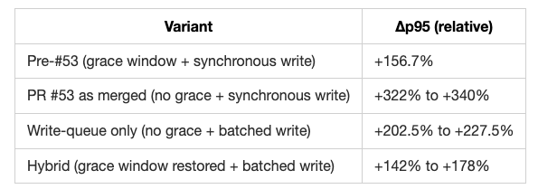
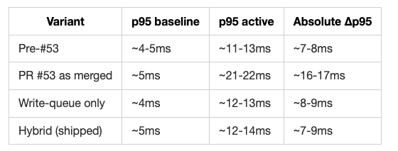

> Cada número es el promedio de 3 corridas de Artillery de 60s/20req-s contra tráfico benigno
> (login, ver posts, ver un post, ver perfil), mismo Docker image, cambiando solo `LOGSGUARDIAN_DISABLED`.
>
> | Métrica | Baseline (sin middleware) | Activo (+logSguarDian) |
> |---|---|---|
> | p95 (por corrida: 4, 4, 4 / 13.9, 10.1, 19.9 ms) | 4.0ms | 14.6ms |
> | Δp95 | — | +265.8% |
> | Gate (≤10%) | — | **FAIL** |
>
> Cero falsos positivos: los 3,600 requests benignos por corrida devolvieron 200/302 en ambas
> configuraciones (cero 403).
>
> **Desglose del sobrecosto** — aislando la escritura de SQLite del resto del costo del middleware
> (mismo tráfico, con `dbPath: ':memory:'`):
>
> | Config | p95 (promedio de 3 corridas) |
> |---|---|
> | Sin middleware | 4.0ms |
> | Middleware, DB en disco | 14.6ms |
> | Middleware, DB en `:memory:` | 11.0ms |
>
> | Contribuyente | Impacto medido |
> |---|---|
> | Virtualización de Docker Desktop/macOS vs. el baseline en Node puro de A19 | Diferencia de entorno, no comparable al Δp95=0ms de A19 |
> | Escritura síncrona a SQLite (`store.log`) | ~25% del sobrecosto (14.6ms → 11.0ms con `:memory:`) |
> | Viaje de ida y vuelta al `worker_thread` (IPC + inferencia ONNX) | ~75% del sobrecosto (11.0ms residual tras quitar el I/O de disco) — no se aisló más en esta investigación |
> | Falta de warmup de la sesión ONNX | Factor contribuyente, no aislado por separado |
>
> El costo dominante es el viaje al `worker_thread` (inferencia RF/IF), no la escritura en SQLite —
> consistente con lo que dice `docs/results.md` §F6.5 sobre por qué el criterio relativo falla incluso
> con la arquitectura ya optimizada.

### Otras métricas de aceptación del protocolo

| Métrica | Estado | Evidencia |
|---|---|---|
| Cobertura ≥ 80 % por categoría de payload | Cumplida (97.3–100 % por categoría en Ronda 4; ver también `docs/STATUS.md`) | ,  |
| Paridad ONNX < 0.1 % | Cumplida: diferencia máxima ~9.5e-08 (RF) y ~2.4e-07 (IF) | 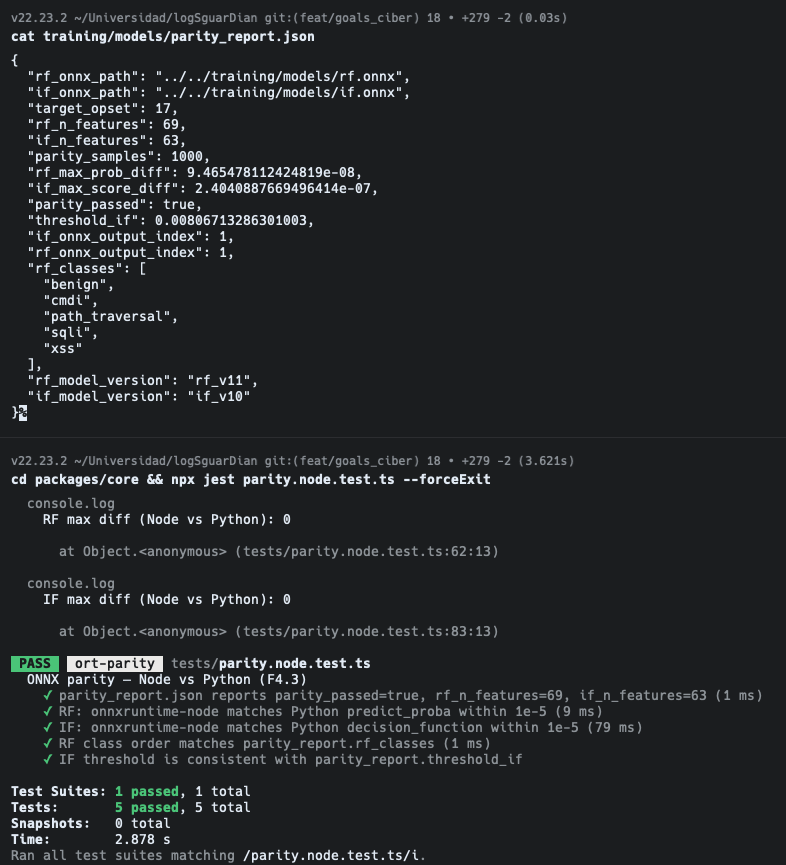 `parity_report.json` y test de paridad |

---

## Riesgos abiertos consolidados

1. Lectura única de test de `rf_v11` pendiente; `class_metrics.json` y `attacks inspect` aún en `rf_v3`.
2. Tabla OWASP/MITRE sin validar contra fuentes oficiales, y posible inconsistencia de A03 para Path Traversal.
3. Redacción de OE2 ("entorno que genere el dataset") frente a la práctica real (fuentes públicas).
4. Cifra "1,155,302 filas" obsoleta en `docs/architecture.md`.
5. Cambio de métrica de latencia (relativa → absoluta) sin comunicar aún al asesor.

## Artefactos citados

`training/label_map.yaml` · `training/parsers/` · `training/split.py` · `training/splits/test.lock.sha256` ·
`training/models/parity_report.json` · `docs/dataset-audit.md` · `docs/decision-policy.md` ·
`docs/feature-spec.md` · `docs/limitations.md` · `docs/results.md` · `docs/STATUS.md` ·
`docs/vulnerable-app-evaluation/` · `e2e/detection.test.ts`.
