# Cumplimiento de los objetivos de ciberseguridad — logSguarDian

**Alcance:** objetivo general y objetivos específicos (OE1, OE2, OE3) del protocolo de ciberseguridad
(Sebastián Huertas), más las métricas de aceptación que el protocolo asocia a ellos.
**Fecha:** 2026-09-26 (actualizado — versión anterior: 2026-09-19).
**Modelos vigentes:** `rf_v11` / `if_v10` (`training/models/parity_report.json`). **Nota de procedencia:**
el binario `rf.onnx`/`if.onnx` actual es un retrain del 2026-09-26 (`training/results/v11_test_results.json`,
verificado por checksum) — sustituye tanto las cifras de `rf_v3` como una lectura de test intermedia
del 2026-09-23 que resultó estar atada a un modelo huérfano (ver OE3.1).

## Resumen

| Objetivo | Estado | Nota clave |
|---|---|---|
| Objetivo general | **Cumplido, con dos salvedades** | Librería publicada en npm (`logsguardian@0.1.0`); salvedades: latencia (OE3.2) y generalización fuera de la app de calibración (falsos positivos 92.5-100% en 3 apps de terceros, ver abajo) |
| OE1 — cuatro vectores, OWASP/MITRE | **Cumplido** en la implementación | La tabla OWASP/MITRE no existía en el repo; se propone abajo y debe validarse |
| OE2 — dataset ≥ 100,000 muestras | **Cumplido** en tamaño (~383,000) | Balance resuelto por ponderación, no por conteos iguales; ver salvedades |
| OE3.1 — F1 ≥ 0.80 en ≥ 3/4 categorías | **Cumplido** (4/4) | Lectura de test de `rf_v11` cerrada (macro F1 0.9776, checksum verificado) — ya no depende de `rf_v3` |
| OE3.2 — Δp95 de latencia | **No cumplido, por margen grande** | Linux real (2026-09-26): +485% (normal) a +278% (ataque). Hallazgo nuevo grave: bajo volumen de datos, 7.00% de timeouts (corregido el 2026-10-02, era 14% por un error de conteo) — colapso por saturación, no solo latencia alta. Modelo del benchmark sin reconciliar aún contra el `rf_v11` final de PR #79 |

---

## Objetivo general

> Diseñar e implementar una librería npm que integre un pipeline de ingeniería de características y un
> modelo híbrido de ML capaz de detectar y clasificar amenazas conocidas y anomalías estadísticas […] en
> tiempo de ejecución […] sin comprometer el rendimiento del servidor anfitrión.

| Componente del objetivo | Dónde se cumple |
|---|---|
| Librería npm | `packages/core`, publicada como `logsguardian@0.1.0` (CI de publicación en `.github/workflows/ci.yml`) |
| Pipeline de ingeniería de características | `packages/extractor` — 76 features (creció de 75 a 76 el 2026-09-25 con `non_json_quote_count`, PR #75; excluida de RF/IF hasta su propio retrain — ver `packages/core/src/worker.ts`), implementación única en TypeScript (`docs/feature-spec.md`, aún no actualizado a 76) |
| Modelo híbrido | RF (supervisado, autoridad de bloqueo) + IF (no supervisado, solo registro/alerta) en ONNX; política en `docs/decision-policy.md` |
| Amenazas conocidas y anomalías | RF clasifica 4 clases + benigno; IF marca anomalías (`pass_anomaly`) |
| Tiempo de ejecución sin bloquear el Event Loop | Inferencia en `worker_threads` (RF dedicado + pool de IF), `docs/architecture.md` |
| Sin comprometer el rendimiento | Parcial: ver OE3.2 |
| Generalización fuera del entorno de calibración | **Riesgo real, observado en 4 apps de terceros nunca usadas en calibración ni entrenamiento** (DVNA, node-api-goat, dvws-node — este estudio — y OWASP Juice Shop — investigación paralela, ver abajo). En las 3 primeras: recall alto en ataques reales (92.5-100% por clase) junto con 92.5-100% de falsos positivos en tráfico benigno — con bloqueo casi total en ambos lados, el alto recall por sí solo es evidencia débil de discriminación útil; es compatible con un problema de calibración o sesgo del modelo frente a esta forma de tráfico, no con una causa ya aislada (ningún estudio corrió un barrido de `RF_THRESHOLD` que permita separar cuánto viene del umbral). **Hallazgo compatible entre dos investigaciones independientes, sin que esto aísle una causa exacta común a las 4 apps:** `docs/limitations.md` (addendum "magnitud de la dependencia de RF en el User-Agent", mergeado desde `develop` el 2026-10-02) cuantifica un sesgo de representación en el corpus de entrenamiento — solo 0.4% de las filas benignas de `unified.jsonl` tienen UA >40 caracteres, frente a 33.3-97.7% en las clases de ataque — y lo valida en Juice Shop (624 requests, modo `monitor`): con una cadena de UA de navegador específica, 97.1% bloqueado (303/312); con curl, 39.4% (123/312). El propio addendum acota ese resultado a esa cadena de navegador y reconoce que otros UA (Windows desktop, okhttp) no producen el mismo efecto en el caso que describe — no es una propiedad uniforme de "todo UA largo". El hallazgo de dvws-node de este estudio (UA de navegador real empeoró el FP de 75% a 92.5%) coincide en **dirección** con eso y refuta la hipótesis estrecha de que un UA corto es la causa exclusiva, pero no aísla por sí solo la misma causa que Juice Shop ni explica todos los falsos positivos de las 3 apps. Lo que puede afirmarse: los resultados son compatibles con el sesgo de representación de UA documentado; lo que no puede afirmarse todavía: que esa sea la causa exacta y exclusiva en las 3 apps de este estudio. Evidencia de Juice Shop: `docs/findings-evidence/juice-shop-ua-bias/`. **Limitación metodológica de las 3 apps de este estudio:** la evidencia cruda ahora vive también en `docs/vulnerable-projects-tests/evidence/` dentro de este repo (copiada el 2026-10-02 desde los clones locales), que siguen sin commitear ni subir; los JSON respaldan conteos de bloqueo por estado HTTP, no las confirmaciones manuales de explotación (hash extraído, archivo leído, comando ejecutado) narradas en cada `-results.md`, que no tienen captura de respuesta adjunta. Ver `docs/vulnerable-projects-tests/` para el detalle y las salvedades por app. |

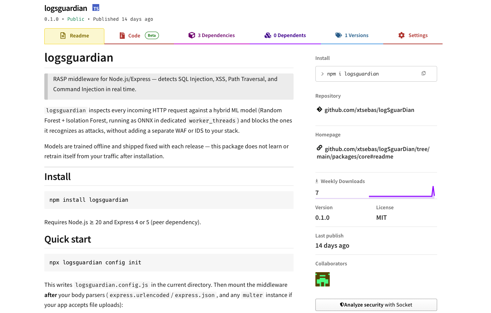
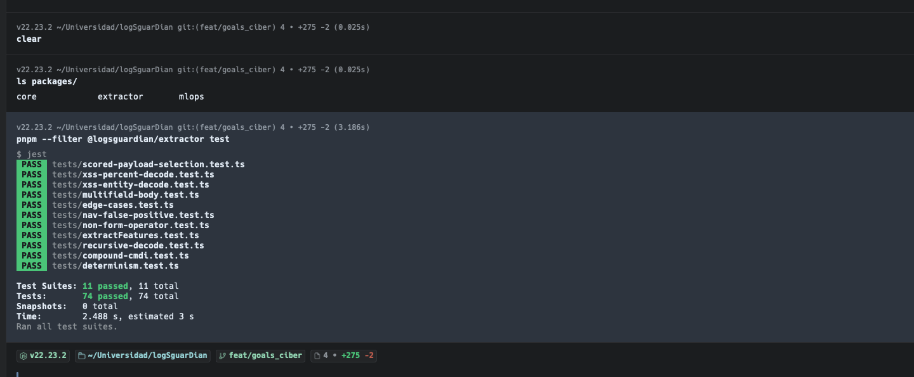

---

## OE1 — Evaluar los cuatro vectores de ataque

**Exige:** evaluar SQLi, XSS, Path Traversal/LFI y Command Injection según OWASP Top 10 2021 (A03:2021)
y MITRE ATT&CK, para fijar las categorías del dataset (OE2) y los criterios de evaluación (OE3).

**Dónde se cumple:** las cuatro categorías son la columna vertebral del proyecto:

- `training/label_map.yaml` — taxonomía canónica de cinco clases (`sqli`, `xss`, `path_traversal`, `cmdi`,
  `benign`) y mapeo de cada dataset a ellas. Para CAPEC se usan las columnas 66 (SQLi), 126 (Path
  Traversal), 88 y 248 (OS Command Injection) y 242 (Code Injection, asignada a `xss`).
- `docs/feature-spec.md` — los grupos de features 4–7 están definidos por categoría de ataque
  (SQLi, XSS, Path Traversal, Command Injection), con la categoría que discrimina cada feature.
- `docs/dataset-audit.md` — cada fuente auditada indica qué categorías cubre.
- Los criterios de OE3 (F1 por clase) se calculan sobre exactamente estas cuatro categorías.

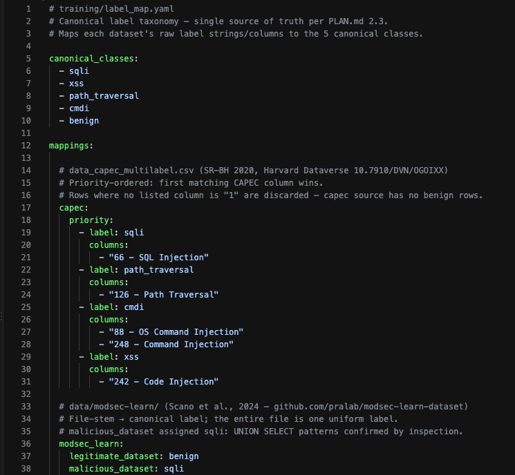
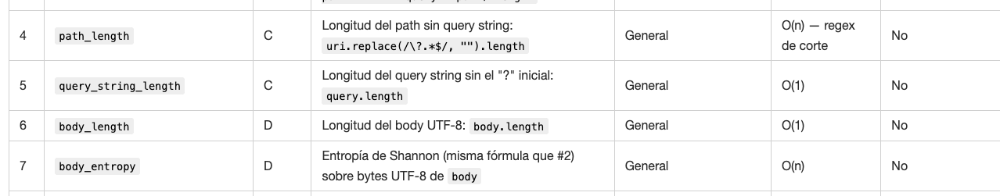
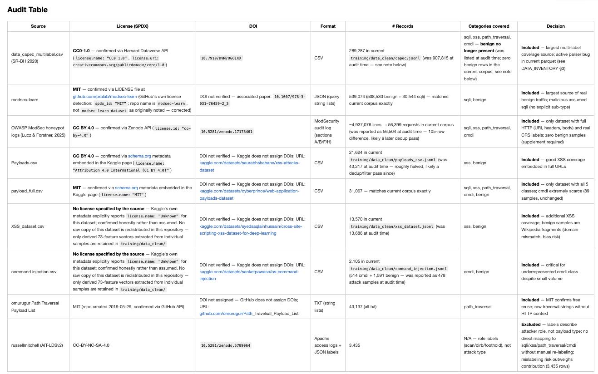

### Tabla OWASP / MITRE (propuesta, por validar)

El repo no tenía ninguna referencia a OWASP Top 10 ni a MITRE ATT&CK (`grep` en `docs/` sin resultados).
Esta tabla se arma con conocimiento general, **no con una fuente verificada en el repo**: hay que
contrastarla con las páginas oficiales antes de incluirla en el informe.

| Vector | OWASP Top 10 2021 | CWE | CAPEC | MITRE ATT&CK (aprox.) |
|---|---|---|---|---|
| SQL Injection | A03:2021 Injection | CWE-89 | 66 | T1190 Exploit Public-Facing Application |
| XSS | A03:2021 Injection | CWE-79 | 63 (ver nota) | Cobertura parcial: ataque al cliente; T1190 solo cubre el lado servidor |
| Path Traversal / LFI | **A01:2021 Broken Access Control** (ver nota) | CWE-22 | 126 | T1190 |
| Command Injection | A03:2021 Injection | CWE-78 | 88 | T1190 → T1059 Command and Scripting Interpreter |

**Notas a resolver antes de defender:**

1. El protocolo dice que los cuatro vectores se justifican por **A03:2021**. Según mi lectura de la
   taxonomía 2021, CWE-22 (Path Traversal) se clasifica en **A01:2021 (Broken Access Control)**, no en
   A03. Si es así, la frase del OE1 es inexacta para ese vector y conviene ajustarla o justificarla.
2. `label_map.yaml` asigna CAPEC-242 (Code Injection) a `xss`. Es una decisión de mapeo del dataset, no
   una equivalencia conceptual; debe declararse como tal en el informe.
3. ATT&CK no modela bien los ataques del lado cliente; decir "cobertura parcial" para XSS es más
   defendible que forzar una técnica.

---

## OE2 — Dataset de al menos 100,000 muestras etiquetadas

**Exige:** un entorno controlado y reproducible que genere un dataset estructurado de ≥ 100,000 muestras
HTTP etiquetadas, balanceando tráfico legítimo y ataques, con scripts de generación y metodología de
etiquetado documentados.

### OE2.1 — Tamaño (≥ 100,000): cumplido

Cifras confirmadas por partida doble (dos lecturas de test independientes, mismo `test.lock.sha256`
`7486c258...`): `training/results/v11_test_results.json` (2026-09-26) reporta `n_test_rows: 57481`;
val/train confirmados por conteo directo de `training/splits/*.parquet` en la misma generación.

| Partición | Filas |
|---|---|
| Train | 268,240 |
| Val | 57,481 |
| Test | 57,481 |
| **Total** | **383,202** |

Conteo por clase en el test set (`v11_test_results.json`): benign 14,886 · sqli 34,107 · xss 4,491 ·
path_traversal 2,529 · cmdi 1,468. (El conteo por clase en train de la versión anterior de este
documento — sqli 159,138, benign 69,379, etc. — venía de una exploración previa a la regeneración del
12 de septiembre y no se reconfirmó línea por línea; usar la distribución de test arriba como la
verificada.)

Antes de deduplicar y filtrar, las fuentes crudas suman más de 930,000 filas (`docs/dataset-audit.md`).
La estimación de 585,000–645,000 de `training/ML_READINESS.md` es de antes de corregir los parsers y
**ya no es la cifra vigente**; las cifras de la tabla superior sustituyen a esa estimación.

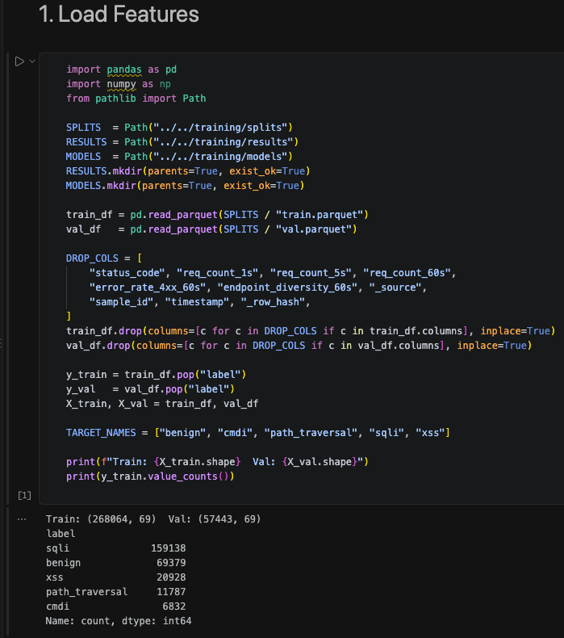

### OE2.2 — Balance entre tráfico legítimo y ataques: cumplido por mitigación, no por conteos iguales

El corpus **no está balanceado** (sqli es ~59 % de train y cmdi ~2.5 %). El desbalance se trata con
`class_weight='balanced_subsample'` en el RF y con la estrategia de muestreo de
`training/SAMPLING_STRATEGY.md` (`PLAN.md` 2.5 admite ponderación, SMOTE o submuestreo). Se probó SMOTE
para cmdi y se descartó con evidencia; lo que sí funcionó fue añadir datos reales diversos
(`docs/limitations.md` §1 y §1.1). Falta confirmar cuál parte del muestreo de `SAMPLING_STRATEGY.md`
(submuestreo de benign/sqli) se aplicó en el pipeline vigente, porque el documento describe el plan y no
el resultado final.

> **Distribución cruda antes de muestrear** (974,718 filas, 7 fuentes):
>
> | Clase | Cantidad cruda | % del total |
> |---|---|---|
> | benign | 563,689 | 57.8% |
> | sqli | 295,770 | 30.3% |
> | path_traversal | 69,176 | 7.1% |
> | xss | 37,113 | 3.8% |
> | cmdi | 8,970 | 0.9% |
>
> **Por qué SMOTE en cmdi:** tras el split, cmdi queda con ~6,279 muestras de entrenamiento — una
> proporción benign:cmdi de ~63:1 observada directamente en este dataset. Esa
> proporción, por sí sola (sin apelar a ningún umbral externo), ya es motivo suficiente para probar si
> `class_weight='balanced'` por sí solo basta o si hace falta una técnica adicional — que es exactamente
> lo que el sweep de abajo mide empíricamente. **Nota bibliográfica:** una versión anterior de este
> párrafo citaba un "punto de 10:1" atribuido a He & Garcia (2009) como si fuera una cifra de corte
> verificada en esa fuente; no se ha confirmado la cita textual ni la página, así que se retira como
> justificación numérica. La decisión de probar SMOTE aquí se apoya únicamente en el desbalance propio
> observado (63:1) y en el resultado empírico del sweep, no en una frontera universal de la literatura
> todavía sin verificar. Se aplicó SMOTE (Chawla et al., 2002, `k_neighbors=5`) apuntando a 25,000
> muestras de cmdi (6,279 reales + ~18,721 sintéticas).
>
> **Resultado observado (sweep 2026-06-14):** SMOTE mejoró el F1 de cmdi solo +0.015 en profundidad 15
> (0.593 → 0.608) y no mejoró nada en profundidad 20 (0.772 → 0.763). La ganancia fue marginal — la
> frontera de decisión de cmdi necesita profundidad ≥ 25 sin importar la cantidad de muestras, porque
> el problema es de **separabilidad** en el espacio de features (cmdi se solapa con path traversal y
> con uso benigno de comandos de shell), no de cantidad de datos. Documentado como limitación en la
> tesis (Sección 8.3): SMOTE interpola en el espacio de 66 dimensiones, no en texto crudo, y puede
> generar combinaciones de features que no corresponden a ningún payload real.
>
> Esto es lo que en `docs/limitations.md` §1.1 se resuelve después: no con más muestras sintéticas,
> sino con datos reales diversos (SecLists + PayloadsAllTheThings), que sí rompieron el techo de cmdi.

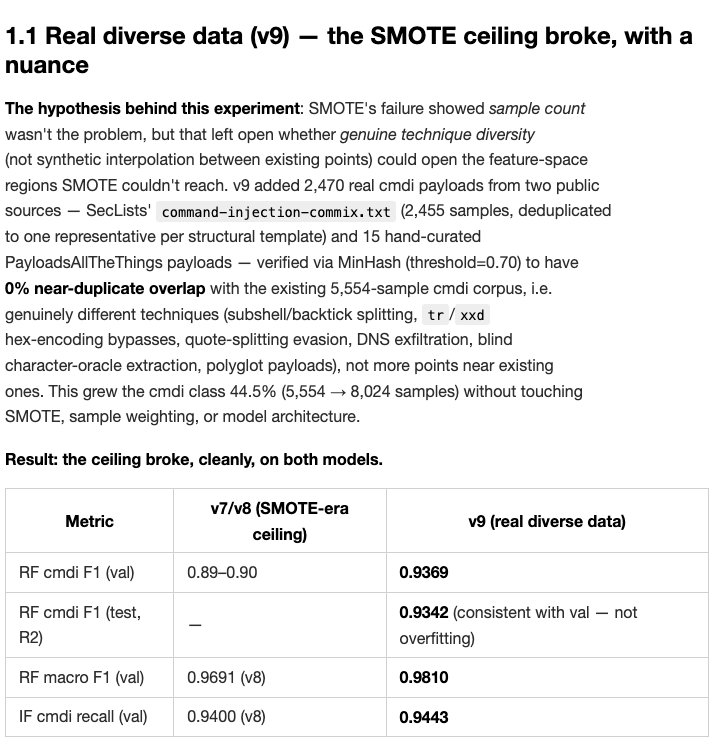

### OE2.3 — Scripts de generación y metodología de etiquetado: cumplido

- Parsers por fuente: `training/parsers/*.py` (9 parsers + `validate_canonical.py`).
- Etiquetado: `training/label_map.yaml`; esquema canónico en `training/CANONICAL_REQUEST_NOTES.md`.
- Deduplicación: `training/DEDUP_METHODOLOGY.md`. Partición estratificada por clase y fuente:
  `training/split.py`.
- Reproducibilidad y anti-fuga: `training/splits/test.lock.sha256` se versiona **antes** de cada
  reentrenamiento (`git log` muestra un commit `lock:` por generación; el más reciente para v11 es
  `6d1fa68`, 2026-09-23, tras encontrarse que el lock commiteado no coincidía con los artefactos en
  disco — ver nota de procedencia al inicio del documento). Desde el 2026-09-26,
  `training/evaluate_test.py` además graba un manifiesto de checksums (`test.parquet`, `rf.onnx`,
  `if.onnx`) junto a cada lectura, y `rf_v11.pkl`/su metadata pasaron a estar trackeados en git —
  cierra el hueco que permitió que un candidato sin promover sobreescribiera el `.pkl` de producción
  bajo el mismo nombre sin que nada lo detectara (ver OE3.1).

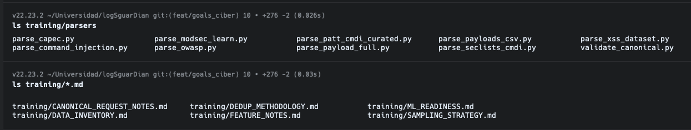
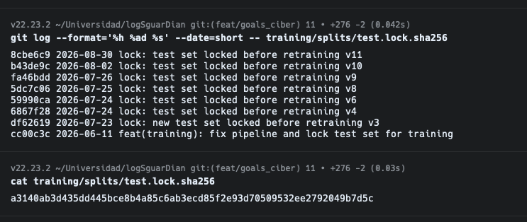

### Salvedades de OE2

1. **"Entorno … que genere un dataset".** El dataset se construye a partir de fuentes públicas
   (CAPEC/SR-BH, ModSec-Learn, OWASP honeypot, payload_full, etc.) más conjuntos sintéticos pequeños
   (`training/data_clean/`). El entorno Docker de prueba (`logSguarDian-vulnerable-project`) se usa para
   **evaluar**, no para generar el corpus de entrenamiento. Si el tribunal lee el OE2 literalmente, este
   es el punto más débil; conviene redactarlo en el informe como "dataset construido con fuentes
   públicas y validado en un entorno controlado".
2. **Un solo número canónico.** `docs/architecture.md` §2 todavía cita "1,155,302 filas / 72 features"
   de un pipeline anterior (marcado como no verificado en `docs/STATUS.md`). Hay que reemplazarlo por
   la cifra de la tabla de OE2.1.
3. **Re-bloqueo del test set.** `test.lock.sha256` se regeneró para v3, v4, v6, v8, v9, v10 y v11 (al
   menos 7 veces, no 5). La disciplina de "leer el test una vez" se aplica por generación de modelo;
   debe declararse así en la sección de amenazas a la validez. Mitigado parcialmente desde el
   2026-09-26: el lock en sí protege la *identidad* de fila (hash de path+query+body+label), no el
   contenido de features, así que es correctamente invariante a cambios del extractor — pero antes de
   esa fecha nada ataba un número citado al contenido exacto (byte a byte) del modelo/test-set que lo
   produjo; el manifiesto de checksums de `evaluate_test.py` cierra esa brecha específica hacia
   adelante, no retroactivamente para las generaciones anteriores a v11.

---

## OE3 — Efectividad de la detección

### OE3.1 — Precisión, recall y F1 por categoría (criterio: F1 ≥ 0.80 en ≥ 3 de 4): cumplido

**Cifras oficiales, actuales (test set bloqueado, lectura única, `rf_v11`/`if_v10`;
`training/results/v11_test_results.json` + `training/models/class_metrics.json`, ambos 2026-09-26,
n = 57,481, hash de lock y checksums de `rf.onnx`/`if.onnx`/`test.parquet` verificados antes de leer):**

| Clase | Precisión | Recall | F1 | AUC-ROC |
|---|---|---|---|---|
| cmdi | 0.9015 | 0.9475 | **0.9239** | 0.9990 |
| path_traversal | 0.9853 | 0.9798 | 0.9826 | 0.9990 |
| sqli | 0.9955 | 0.9956 | 0.9956 | 0.9998 |
| xss | 0.9950 | 0.9804 | 0.9877 | 0.9993 |
| benign | 0.9984 | 0.9985 | 0.9984 | 1.0000 |
| **Macro F1** | | | **0.9776** | |

**4/4 categorías ≥ 0.80**, por encima del mínimo de 3/4. AUC-ROC por clase (One-vs-Rest) se reporta
por primera vez en este proyecto — no existía en ningún artefacto antes de esta lectura.

**IF (`if_v10`), mismo test set, threshold congelado (nunca recalibrado contra test):** recall 0.9125,
FP rate 0.0546, precisión 0.9795. Ambos criterios del protocolo (recall ≥ 0.50 y FP ≤ 0.10) se
cumplen con margen.

**Brecha cerrada, con una vuelta de tuerca en el camino.** La versión anterior de este documento
señalaba que las cifras oficiales eran de `rf_v3` y que faltaba la lectura de test de `rf_v11`. Esa
lectura se hizo (2026-09-23, macro F1 0.9843) — pero resultó estar atada a un `rf_v11.pkl` que había
sido sobreescrito silenciosamente por un candidato sin promover de una investigación paralela
(`investigate/benign-persona-diversification`, PR #75), sin que nada lo detectara porque el `.pkl`
no estaba trackeado en git. Un retrain limpio contra el contrato de producción real (69/63 features)
el 2026-09-26 produjo las cifras de arriba, que **reemplazan** las del 23 de septiembre. `cmdi` bajó
de 0.9516 (cifra ahora inválida) a 0.9239 (cifra real) — sigue muy por encima del gate de 0.80.
`training/models/class_metrics.json` y `logsguardian attacks inspect` ya muestran `rf_v11`, no `rf_v3`.

**Pendiente, no bloqueante:** `docs/decision-policy.md` §2.1 (la fuente que este documento citaba como
"oficial") todavía no se actualizó con esta tabla — sigue mostrando la de `rf_v3`, anotada como
histórica pero no reemplazada. Hay que sincronizarla por separado.

**"Bajo condiciones de tráfico simulado":**

- Suite E2E (`e2e/detection.test.ts`, `pnpm run test:e2e`): 100 payloads por clase enviados por HTTP real
  contra Express con el middleware y los ONNX reales (`docs/results.md` §F5.7).
- **Corpus SecLists de 590 payloads, Ronda 4 — con fuga confirmada, ya no citable como cifra principal.**
  Se confirmó que el corpus de cmdi de esta ronda venía del mismo archivo SecLists usado en
  entrenamiento (100 % de los 200 payloads colapsan a una plantilla ya vista). Tabla histórica,
  conservada solo por trazabilidad — **no usar estos números en el informe**:

  | Categoría | Solo logsguardian | Solo WAF (CRS PL1) | Capas (WAF + logsguardian) |
  |---|---|---|---|
  | sqli | 98.7 % | 85.7 % | 100.0 % |
  | xss | 97.3 % | 97.3 % | 100.0 % |
  | path_traversal | 98.5 % | 87.0 % | 98.5 % |
  | cmdi | 100.0 % (inflado por fuga) | 100.0 % | 100.0 % |
  | **Total** | **98.8 %** (583/590) | 93.2 % | 99.5 % |

  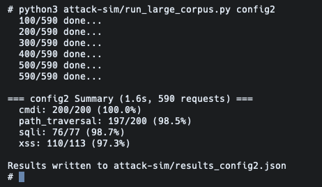
  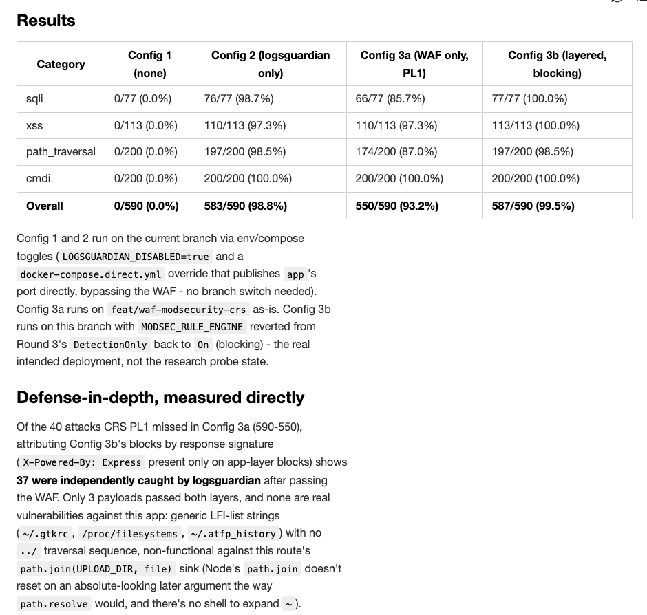

- **Ronda 5 (corpus limpio, sin fuga) — cifras vigentes, solo Config 2 (logsguardian activo, sin WAF):**
  generado con sqlmap (sqli), generadores propios no derivados de SecLists (path_traversal, cmdi), y
  filtrado por exclusión contra el corpus de entrenamiento completo antes de incluir cualquier payload.

  | Categoría | Ronda 4 (con fuga) | Ronda 5 (limpia) |
  |---|---|---|
  | sqli | 98.7 % | 100.0 % |
  | path_traversal | 98.5 % | **85.0 %** |
  | cmdi | 100.0 % (fuga) | **91.5 %** (real) |
  | xss | 97.3 % | placeholder — ZAP manual pendiente, no citable |

  cmdi 91.5 % es la tasa de detección real contra payloads que el modelo nunca vio; el 100 % anterior
  era memorización de plantilla. path_traversal bajó (85.0 % vs. 98.5 %) no por fuga (0 coincidencias
  confirmadas) sino porque este corpus es más diverso en encoding — hallazgo genuino, no artefacto de
  medición. Las variantes con WAF (3a/3b) y el baseline (Config 1) no se re-corrieron con este corpus
  todavía. Fuente: repo `logSguarDian-vulnerable-project`, `docs/config3b-results.md` §Ronda 5 (ruta
  corregida — la carpeta `docs/vulnerable-app-evaluation/` ya no existe, el repo hermano aplanó sus
  docs directo a `docs/`).

De los 40 ataques que el WAF dejó pasar en Ronda 4 (con fuga), logsguardian detuvo 37 de forma
independiente — este hallazgo de defensa en profundidad no depende de la fuga de cmdi (viene
mayormente de sqli/path_traversal/xss) y se mantiene válido, pero no se ha re-confirmado con el
corpus de Ronda 5 todavía.

> **obj3-a y obj3-b son históricas, no son las cifras vigentes.** obj3-a muestra `rf_v3.pkl` sobre
> `test.parquet` (macro F1 0.9682, n=59,947 — partición y modelo distintos a los de la tabla de
> arriba). obj3-b muestra un `classification_report` sobre el **validation set**, no el test set, de
> una generación de modelo anterior (macro F1 0.9831). Se conservan por trazabilidad de cómo
> evolucionaron las cifras, pero **la tabla de OE3.1 de arriba (`rf_v11`/`if_v10`, macro F1 0.9776,
> test set) es la única citable**.

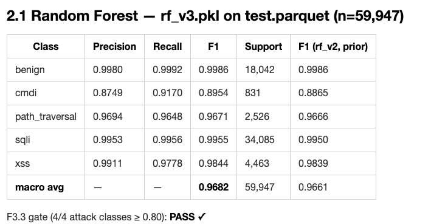
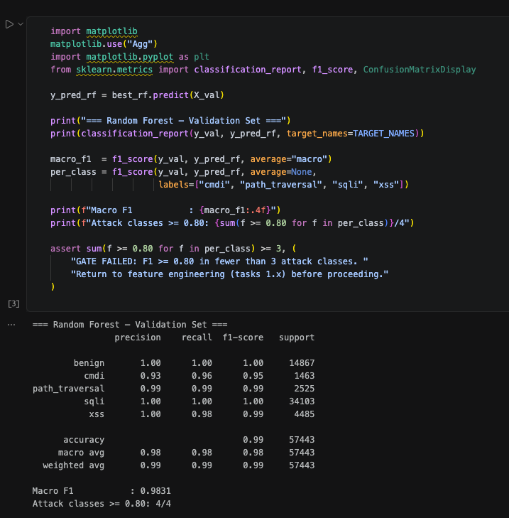
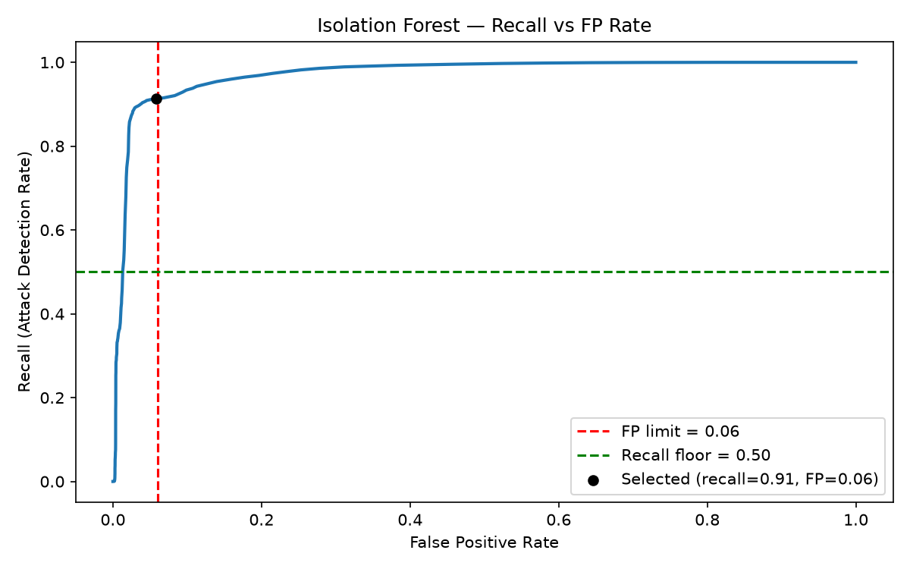
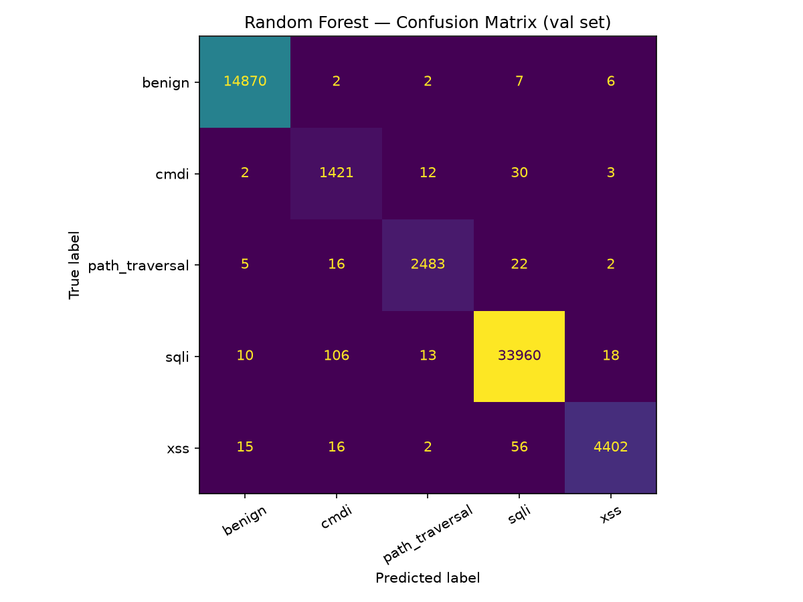
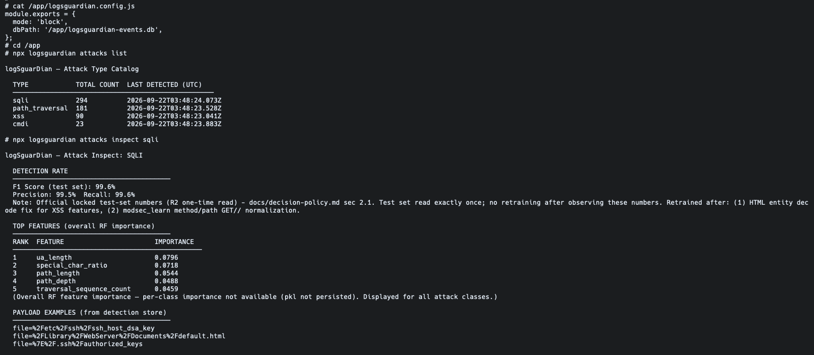
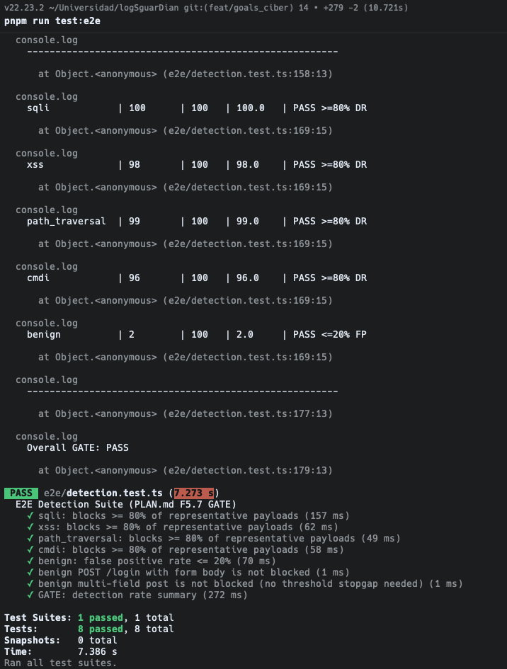

### OE3.2 — Latencia Δp95 (métrica de aceptación asociada): no cumplido, y un hallazgo grave nuevo

El criterio no está en el texto del OE3 anterior, sino en las métricas de aceptación del protocolo:
Δp95 ≤ 5 % (carga normal) y ≤ 10 % (carga de ataque); `PLAN.md` F6.2 lo enuncia además en forma absoluta
(Δp95 ≤ 5 ms por solicitud).

**Decisión revisada (2026-09-26): se abandona la "Decisión A" del 2026-09-19.** La versión anterior de
este documento evaluaba el criterio en forma absoluta, argumentando que la forma relativa "diverge"
contra un baseline casi nulo. El asesor rechazó ese cambio de métrica hecho después de ver el
resultado y señaló, correctamente, que el baseline real (~4-5 ms) no tiende a cero — el criterio del
protocolo simplemente está calibrado de forma optimista para una app de este perfil de latencia.
Se reporta la **forma relativa como primaria** (la que aprobó el protocolo), con la absoluta como
análisis complementario.

**Resultados reales, Linux nativo (GitHub Actions `ubuntu-latest`, corrida del 2026-09-26, workflow
`latency-benchmark.yml`, 5 corridas por condición, mediana — metodología de descarte de extremos
verificada matemáticamente equivalente a la mediana simple para n=5):**

| Escenario | p95 sin middleware | p95 con middleware | Δp95 absoluto | Δp95 relativo | Fallos (timeouts) |
|---|---|---|---|---|---|
| Normal (navegación benigna) | 2.49 ms | 14.57 ms | 12.08 ms | **+485.1 %** | 0 / 0 |
| Ataque (benigno + payloads concurrentes) | 4.62 ms | 17.47 ms | 12.85 ms | **+278.1 %** | 0 / 0 |
| **Volumen (2010 filas sembradas)** | 63.84 ms | **6,559.3 ms** | **~6.5 s** | **+10,174.6 %** | **1,824 timeouts / 26,048 requests (7.00 %)** |

> **Nota metodológica — qué es exactamente este "p95".** El parser que produce estos valores
> (`*.parsed.json` del artifact de `latency-benchmark.yml`) calcula cada p95 de la tabla como un
> **promedio ponderado por conteo de los p95 de cada bucket** post-warmup de Artillery, no como un
> percentil exacto recalculado sobre el conjunto completo de muestras de la corrida. El propio archivo
> lo declara explícitamente: *"p50/p95/p99 are count-weighted averages of per-bucket percentiles from
> post-warmup buckets only — see file header comment for why this is an approximation, not an exact
> merge."* Un promedio de percentiles parciales no es, en general, idéntico al percentil calculado sobre
> todas las muestras juntas. Esto no afecta la mediana de 5 corridas (esa agregación sí es exacta); afecta
> la magnitud de cada p95 individual que entra a esa mediana. Es especialmente relevante en el escenario
> de Volumen, donde el propio texto de abajo describe que el comportamiento cambia a lo largo de la
> corrida (colapso hacia el final) — un promedio por bucket diluye esa variación en vez de capturar el
> percentil real de cola sobre la corrida completa. Los números de la tabla son los que produce el
> harness tal como está escrito, no una medición estadísticamente exacta del percentil agrupado; no se
> recalculó un percentil exacto a partir de las muestras crudas para esta corrección.

**Veredicto oficial: NO CUMPLIDO, por un margen mucho mayor al que se creía.** Ni la forma relativa ni
la absoluta se acercan a cumplirse en ningún escenario — los números de Docker Desktop/macOS que
tenía la versión anterior de este documento (+142% a +178%, ~7-9ms) **subestimaban el problema**: en
Linux nativo, con metodología correcta (100 req/s real, warmup separado, 5 corridas), el escenario
normal ya da +485%, no +142-178%.

**Hallazgo nuevo y grave: bajo volumen de datos realista, el sistema entra en colapso por saturación,
no solo en latencia alta.** La hipótesis original (`docs/vulnerable-app-evaluation` histórico,
sembrar más filas para que el baseline suba y el Δ relativo se vea mejor, que había dado +70.2% en una
medición manual anterior) **no se confirmó — ocurrió lo opuesto**. Verificado directamente en los logs
crudos de Artillery (no solo en el resumen, y recalculado tras un error de conteo encontrado en
revisión — ver nota de corrección abajo): **1,824 de 26,048 requests del escenario de volumen con
logsguardian activo terminaron en `ERR_SOCKET_TIMEOUT` (7.00%)** (0 timeouts en cualquier otra
combinación de escenario/condición), y las que sí completaron tardaron hasta 6.5-7.3 segundos. Dentro
de cada rep de 75s los timeouts se concentran en los últimos buckets de ~10s (ej. rep 1:
0,0,0,0,76,107,62,68,92 por bucket, sumando 405 para esa rep — los 5 reps suman 1,824) — un patrón de
acumulación de cola hacia el final de la corrida, no de solicitudes lentas individuales desde el
inicio. La causa más probable, sin confirmar aún con instrumentación dedicada: la ruta `GET /posts`
sin paginar ya es lenta con 2010 filas sin middleware (63.84ms vs 2.49ms normal, ~26×), y el overhead
añadido de logsguardian sobre una app ya más lenta empuja el tiempo de servicio efectivo por debajo de
la tasa de llegada (~100 req/s), generando una cola creciente — un problema de capacidad/backpressure,
no solo de latencia por solicitud. **Esto requiere una investigación de causa raíz dedicada antes de
poder afirmar que logsguardian es seguro de desplegar contra tráfico con volúmenes de datos
realistas**, y es independiente del veredicto de Δp95 en sí — de hecho posiblemente más serio para la
tesis. Un 7% de timeouts sigue siendo una falla operacional seria (nadie diseña para perder 1 de cada
14 requests bajo carga), aun corregido desde el 14% citado en una versión anterior de este documento.

> **Corrección (2026-10-02):** la versión anterior de esta sección citaba 3,648 timeouts (~14%). Era un
> error de conteo: el script de verificación sumó tanto los contadores de cada bloque intermedio de
> Artillery como el `vusers.failed` del *Summary report* final de cada rep, que ya es el total
> acumulado de esos mismos bloques — duplicando el conteo. Recalculado leyendo únicamente el Summary
> report de cada una de las 5 reps: **1,824 / 26,048 = 7.00%**. La degradación severa (+485%, +278%,
> +10,174.6%, y el patrón de colapso por cola) no cambia — solo la cifra de timeouts.

> **Procedencia del modelo en este benchmark — sin resolver, declarado explícitamente.** Los
> `rf.onnx`/`if.onnx` vendorizados en `logSguarDian-vulnerable-project` (`models/rf.onnx`, hash
> `a7c015f5...`) **no coinciden** con el par `rf_v11`/`if_v10` canónico actual
> (`training/models/rf.onnx`, hash `25b407e6...`, el mismo verificado por checksum en
> `training/results/v11_test_results.json`). Tienen la forma correcta (69/63 features), pero son una
> generación distinta — probablemente la sincronizada en una corrección anterior del mismo día, previa
> al fix de modelo huérfano de PR #79. Los hallazgos de latencia/colapso de esta sección describen el
> comportamiento de la **arquitectura** (worker pool, IPC, escritura a SQLite, query sin paginar) bajo
> carga, no una propiedad de los pesos específicos del modelo — es razonable esperar que el patrón se
> sostenga con el par corregido, dado que ambos modelos tienen la misma forma e inferencia de costo
> similar — pero **esto no se ha reconfirmado contra el par exacto de PR #79** y no debe citarse como
> si lo estuviera. Pendiente: sincronizar el vendor de `logSguarDian-vulnerable-project` con
> `training/models/*.onnx` actual y volver a correr `latency-benchmark.yml` antes de que estos números
> se usen como cifra final en la tesis.

**Memoria y CPU (mismo run, `analyze-memory.js`, ventana de 41.9 min, 374 muestras — cumple el
requisito de ≥30 min de `PLAN.md` F6.3):** pico 494.8 MB, media 239.8 MB; CPU pico 198.6%, media 60%.
El script marcó `possibleLeak: true` (crecimiento de 84.8% entre la primera y segunda mitad de la
ventana). **Esto sigue siendo inconcluso, no descartado ni confirmado.** El muestreo cubre las 3
corridas de reps de los 3 escenarios en secuencia (normal → ataque → volumen) con reinicios de
contenedor entre corridas, y el pico de memoria coincide con la ventana del escenario de volumen
(23:05-23:18), que es además donde ocurre el colapso por timeouts descrito arriba — una explicación
plausible es "distintos escenarios con perfiles de memoria muy distintos corriendo en secuencia", no
necesariamente un leak dentro de un proceso estable. Pero los reinicios de contenedor y las cargas de
trabajo tan distintas entre escenarios **también impiden descartar un leak real** con esta heurística
de primera-mitad-vs-segunda-mitad — el propio script ya lo advertía ("no tratar como concluyente solo
con esta heurística"). El pico de 494.8 MB en sí (vs. 245.11 MB del benchmark aislado sin carga) es
consistente con un sistema bajo la saturación descrita arriba, con conexiones y trabajo en cola
acumulándose — pero no cierra la pregunta de si también hay un leak independiente de eso. Pendiente:
repetir el monitoreo de memoria dentro de un solo escenario sostenido (sin alternar con otros), para
aislar la variable.

**Cómo leer estos resultados para la tesis:**

- El criterio de latencia bajo carga normal y de ataque no se cumple, por un margen grande, en Linux
  real — no hay forma honesta de presentar esto como "cumplido" ni "casi cumplido".
- El hallazgo de volumen no es parte del criterio de aceptación formal (el protocolo no especifica un
  escenario de volumen), pero es evidencia directa y grave sobre los límites operacionales reales de
  la arquitectura publicada, y debe declararse en la sección de limitaciones/amenazas a la validez con
  la misma honestidad que el resto de hallazgos de este documento.
- Próximo paso técnico concreto: instrumentar el tiempo de cola del pool de workers
  (`packages/core/src/worker.ts`) específicamente durante el escenario de volumen, para confirmar o
  descartar la hipótesis de backpressure antes de proponer un fix.

No hay captura de pantalla de la corrida Linux nativa (2026-09-26) — los números de la tabla de
arriba vienen directamente de `summary.jsonl` y los `.parsed.json` por rep del artifact de
`latency-benchmark.yml`, citados como JSON crudo en vez de captura.

> **Las dos tablas siguientes (capturas `obj3-h1`/`obj3-h2`) son históricas — Docker
> Desktop/macOS, variantes de PR #53, previas a la metodología Linux nativa de arriba.** Se
> conservan solo como contexto de cómo evolucionó el aislamiento del I/O de SQLite; **no deben
> leerse como el estado actual** (+485.1%/+278.1%/+10,174.6% en Linux, arriba, es el veredicto
> vigente).

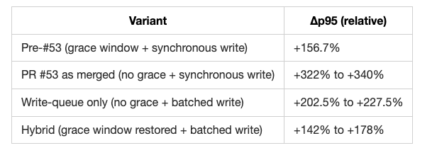
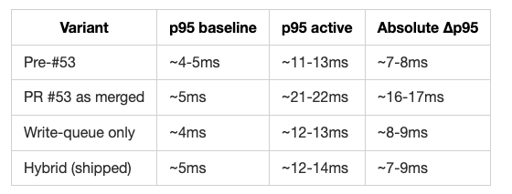

> Cada número es el promedio de 3 corridas de Artillery de 60s/20req-s contra tráfico benigno
> (login, ver posts, ver un post, ver perfil), mismo Docker image, cambiando solo `LOGSGUARDIAN_DISABLED`.
>
> | Métrica | Baseline (sin middleware) | Activo (+logSguarDian) |
> |---|---|---|
> | p95 (por corrida: 4, 4, 4 / 13.9, 10.1, 19.9 ms) | 4.0ms | 14.6ms |
> | Δp95 | — | +265.8% |
> | Gate (≤10%) | — | **FAIL** |
>
> Cero falsos positivos: los 3,600 requests benignos por corrida devolvieron 200/302 en ambas
> configuraciones (cero 403).
>
> **Desglose del sobrecosto** — aislando la escritura de SQLite del resto del costo del middleware
> (mismo tráfico, con `dbPath: ':memory:'`):
>
> | Config | p95 (promedio de 3 corridas) |
> |---|---|
> | Sin middleware | 4.0ms |
> | Middleware, DB en disco | 14.6ms |
> | Middleware, DB en `:memory:` | 11.0ms |
>
> | Contribuyente | Impacto medido |
> |---|---|
> | Virtualización de Docker Desktop/macOS vs. el baseline en Node puro de A19 | Diferencia de entorno, no comparable al Δp95=0ms de A19 |
> | Escritura síncrona a SQLite (`store.log`) | ~25% del sobrecosto (14.6ms → 11.0ms con `:memory:`) |
> | Viaje de ida y vuelta al `worker_thread` (IPC + inferencia ONNX) | ~75% del sobrecosto (11.0ms residual tras quitar el I/O de disco) — no se aisló más en esta investigación |
> | Falta de warmup de la sesión ONNX | Factor contribuyente, no aislado por separado |
>
> El costo dominante es el viaje al `worker_thread` (inferencia RF/IF), no la escritura en SQLite —
> consistente con lo que dice `docs/results.md` §F6.5 sobre por qué el criterio relativo falla incluso
> con la arquitectura ya optimizada.

### Otras métricas de aceptación del protocolo

| Métrica | Estado | Evidencia |
|---|---|---|
| Cobertura ≥ 80 % por categoría de payload | Cumplida para 3/4 categorías medidas (85.0–100 % en Ronda 5, corpus limpio); **xss sin medición real todavía** — el export de ZAP sigue pendiente, no es "cumplida" para esa clase | Tabla de Ronda 5 en OE3.1 arriba (`config3b-results.md` §Ronda 5). No hay captura de pantalla de Ronda 5 todavía — las únicas capturas disponibles (obj3-f/g, ver arriba) son de Ronda 4 (con fuga, histórica), no deben citarse para esta fila |
| Paridad ONNX < 0.1 % | Cumplida: diferencia máxima ~1.0e-07 (RF) y ~2.4e-07 (IF), retrain 2026-09-26 | 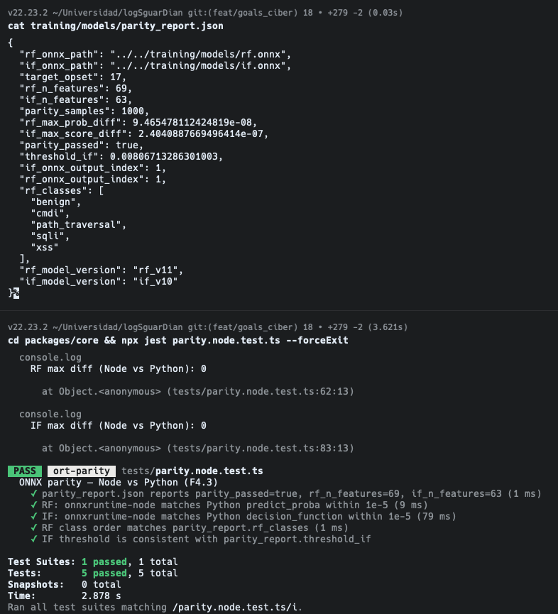 `parity_report.json` y test de paridad |

---

## Riesgos abiertos consolidados

1. **Cerrado (2026-09-26):** lectura única de test de `rf_v11` — hecha, con checksum verificado. Ver
   nota de procedencia al inicio del documento sobre la lectura intermedia del 23 de septiembre que
   quedó invalidada.
2. Tabla OWASP/MITRE sin validar contra fuentes oficiales, y posible inconsistencia de A03 para Path Traversal.
3. Redacción de OE2 ("entorno que genere el dataset") frente a la práctica real (fuentes públicas).
4. Cifra "1,155,302 filas" en `docs/architecture.md` — ya anotada como histórica (2026-09-25), pero
   todavía no reemplazada por un número vigente del pipeline actual.
5. `docs/decision-policy.md` §2.1 sigue mostrando la tabla de `rf_v3`; hay que sincronizarla con
   `training/results/v11_test_results.json`.
6. **Cerrado (2026-09-26):** workflow de latencia en Linux nativo corrido — reemplazadas las cifras de
   Docker Desktop/macOS por los resultados reales (peores de lo estimado: +485% normal, +278% ataque).
7. **Nuevo, alta prioridad:** bajo el escenario de volumen (2010 filas), 7.00% de las requests con
   logsguardian activo terminan en timeout (6.5-7.3s de latencia real, no solo un p95 alto) — 0
   timeouts en cualquier otro escenario/condición. Hipótesis de causa raíz (backpressure del pool de
   workers combinado con una ruta sin paginar) sin confirmar — requiere instrumentación dedicada antes
   de proponer un fix. Independiente del veredicto formal de Δp95, pero potencialmente más serio.
8. **Nuevo:** el `rf.onnx`/`if.onnx` vendorizado en `logSguarDian-vulnerable-project` (usado para el
   benchmark de latencia) no coincide por hash con el `rf_v11`/`if_v10` final de PR #79 — mismo shape,
   generación distinta. Sincronizar el vendor y volver a correr `latency-benchmark.yml` antes de citar
   estos números como finales.
9. **Nuevo:** el heurístico de memoria (`possibleLeak: true`) sigue inconcluso — ni confirmado ni
   descartado, por la mezcla de escenarios y reinicios de contenedor dentro de la misma ventana
   muestreada. Repetir el monitoreo dentro de un solo escenario sostenido.
8. Ronda 5 (corpus limpio) solo cubrió Config 2; faltan Config 1 baseline y las variantes con WAF
   (3a/3b) con el mismo corpus, y el export real de ZAP para xss.

## Artefactos citados

`training/label_map.yaml` · `training/parsers/` · `training/split.py` · `training/splits/test.lock.sha256` ·
`training/models/parity_report.json` · `training/models/class_metrics.json` ·
`training/results/v11_test_results.json` · `training/evaluate_test.py` · `docs/dataset-audit.md` ·
`docs/decision-policy.md` · `docs/feature-spec.md` · `docs/limitations.md` · `docs/results.md` ·
`docs/STATUS.md` · `docs/architecture.md` — repo hermano `logSguarDian-vulnerable-project`:
`docs/config3b-results.md` (nota: la carpeta `docs/vulnerable-app-evaluation/` ya no existe, sus
archivos viven directo en `docs/`) · `.github/workflows/latency-benchmark.yml` ·
`e2e/detection.test.ts`.
